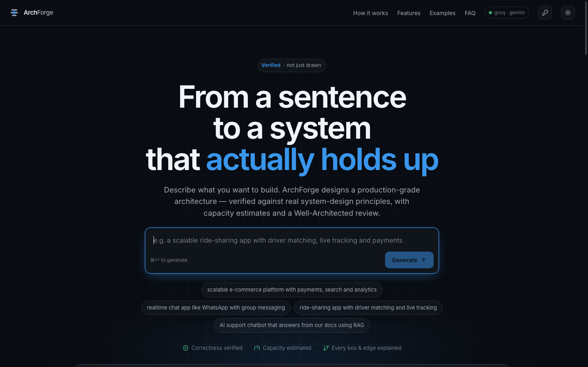

# ArchForge

**Turn a plain-English prompt into an accurate, production-grade system-architecture diagram** — one whose every box and arrow follows real system-design principles, with capacity math and a Well-Architected review. Not an "AI slop" sketch.

> *"a ride-sharing platform like Uber with driver matching, live tracking and payments"*
> → a verified 15–20 component architecture: API gateway, matching service, geospatial index, Kafka streaming, Redis cache, trip datastore, payment gateway, realtime push, auth boundary and full observability — each with a one-line reason, capacity estimates, and a 6-pillar score.

<p align="center">
  
</p>

<p align="center">
  <a href="https://archforge.vercel.app"><b>Try it live →</b></a>
</p>

---

## It matches how the best actually build

ArchForge is benchmarked two ways, and both run from the repo (`server/src/dev/`):

**Ground-truth recall** — given only a one-line prompt, how much of a company's *real, published* architecture does it independently reproduce? (Ground truth curated from Uber Engineering, the Netflix Tech Blog, ByteByteGo / *System Design Interview*, and High Scalability.)

| System | Recall | Blocks reproduced |
|---|---|---|
| Uber | **100%** | gateway, matching, geo-index, Kafka streaming, trip store, payments, cache, realtime push, observability |
| Instagram | **100%** | CDN, load balancer, services, Memcached, Postgres, wide-column store, photo blob store, feed fan-out, notifications, observability |
| WhatsApp | **100%** | realtime gateway, chat services, message queue, message store, push, observability |
| Airbnb | **100%** | gateway, search index, services, relational store, payments, cache, observability |
| Netflix | **89%** | CDN, gateway, microservices, blob, transcoding, cache, recommendations, observability |
| **Overall** | **~98%** | 40 of 41 real building blocks, from one sentence each |

*(The one miss — Netflix's analytics pipeline — isn't named in the prompt, so the design correctly builds only what was asked. We report it honestly rather than tuning the ground truth.)*

**Rubric eval** — every generated design is graded on 10 hard checks (entrypoint, auth, observability, no illegal edges, no orphans, capability coverage, concrete tech, expected components, readiness, non-toy). Across the default 8-prompt suite: **100% — every prompt 10/10**.

### Held-out results (the honest number)

The suites above were run repeatedly while building, so they risk measuring fit-to-the-test-set. `eval-holdout.js` exists to avoid fooling ourselves: **ten unseen domains and five more real systems that never shaped a single keyword, rule or reference** in the engine.

| Held-out measure | Result |
|---|---|
| Rubric on 10 unseen domains<br><sub>multiplayer game · hotel booking · stock trading · LMS · logistics · ticketing · hospital records · crypto exchange · ad serving · podcast hosting</sub> | **100%** — 10/10 prompts, all 11 checks |
| Ground truth vs 5 unseen real systems<br><sub>Twitter · Dropbox · Slack · DoorDash · YouTube</sub> | **100%** — 38/38 blocks, every system at 100% |

```bash
node server/src/dev/eval-holdout.js   # the generalization test
```

```bash
node server/src/dev/eval.js        # rubric accuracy, gated
node server/src/dev/benchmark.js   # ground-truth recall vs real architectures
```

## Why it's trustworthy — accuracy is engineered, not hoped for

The LLM proposes; deterministic **code guarantees**. Three layers:

1. **Grounding + self-consistency.** The model reasons against a curated library of *real* reference architectures (one per capability the prompt needs) and produces several candidates in parallel.
2. **A deterministic verifier picks and repairs the best.** Every candidate is scored by a data-driven principle registry — layer call-rules, DB-per-service, single-point-of-failure, protocol correctness, store-are-sinks. The best-by-score wins (external verifier beats letting the model grade itself). Then it **auto-fixes** rather than merely warns:
   - illegal connections are re-routed or reversed,
   - **orphan nodes are wired in** (a datastore joins its name-matched service; an external API joins its caller),
   - a **read-heavy system gets a cache** injected in front of its datastore,
   - a missing **auth boundary** and **observability** (logging/metrics/tracing) are added.
   So no diagram ever ships invalid, orphaned, cache-less, or unauthenticated.
3. **Measured, not assumed.** The eval + benchmark above turn "accurate" into a number, so regressions are caught. 75 unit/integration tests cover the contracts, engine and verifier.

```
prompt
  → detect capabilities → ground on the closest reference(s)
  → N candidate designs (parallel)  → verifier score → pick best
  → verifier auto-fix (call-rules · orphans · cache · auth · observability · SPOF)
  → capacity estimate + Well-Architected 6-pillar review
  → elkjs layered layout → React Flow (why-tooltips · editable · export PNG/Mermaid/doc)
```

## Runs free (₹0), and never breaks on quota

| Layer | Free option |
|---|---|
| Reasoning | **Groq** (llama-3.3-70b) → **Cerebras** → **Gemini Flash** — automatic failover |
| Host | **Vercel** (static UI + serverless API, one URL) |
| Layout | **elkjs** (deterministic, local) |
| Diagram | **React Flow** |

- **Multi-key rotation.** Add any number of keys (`GROQ_API_KEY`, `GROQ_API_KEY2`, …; same for Gemini) — they rotate round-robin to multiply the free budget.
- **Bring-your-own-key.** A user can paste their own Groq / Cerebras / Gemini / Anthropic key in the UI (the vendor is auto-detected from the prefix). It stays in their browser (localStorage), goes straight to the provider, and is never stored server-side — so a deployed instance keeps working even after the shared keys are spent.
- Verification, capacity math and layout are deterministic and run locally — no model needed. An optional high-accuracy mode can use Anthropic Claude.

## Features

- Accurate, production-grade diagrams (8–30 components) for any domain — simple or multi-subsystem.
- A concrete reason on every component and edge; real tech names, never a vague "database".
- Capacity estimates — QPS, storage, bandwidth, cache size, instance count — exact arithmetic from the assumptions.
- Well-Architected review across the six AWS pillars, with the specific gaps called out.
- **Editable** — rename, retype, add, delete and reconnect; every edit re-runs the verifier, so you can't create an invalid diagram.
- **Refine in natural language** — "add caching", "make it multi-region", "use Cassandra".
- **Export** — PNG, Mermaid, or a Markdown design doc.
- Light + dark, responsive to mobile.

## Develop

```bash
npm install
cp server/.env.example server/.env    # add at least one free key (Groq recommended)
npm run dev                           # API  → http://localhost:8799
npm run dev:client                    # UI   → http://localhost:5175 (separate terminal)
npm test                              # 75 server tests
```

## Deploy (Vercel — one URL, free)

The repo is Vercel-ready: `client/dist` is served statically and every `/api/*` request is routed to the Express app as a serverless function (`api/[...path].js`).

1. Push this folder to its own GitHub repo (`git init` here first — the project should be its own repo).
2. Import it in Vercel. Build settings are picked up from `vercel.json` (build `npm run build`, output `client/dist`).
3. Add your provider keys as **Environment Variables** (`GROQ_API_KEY`, `GROQ_API_KEY2`, …, `CEREBRAS_API_KEY`, `GEMINI_API_KEY`) — never commit them.
4. Deploy. The UI and API share one origin, so no CORS or base-URL config is needed.

## Structure

```
server/            Node + Express API and the reasoning engine
  src/contracts/   shared vocabulary + rules (taxonomy, schema, call-rules, principles)
  src/engine/      pipeline stages (generate, verify, capacity, review, layout, providers)
  src/references/  the curated golden reference library (the accuracy asset)
  src/dev/         eval.js (rubric) · benchmark.js (ground-truth) · smoke/batch tools
client/            React + Vite + React Flow + Tailwind UI
api/               Vercel serverless entry (wraps the Express app)
```

## License

MIT
